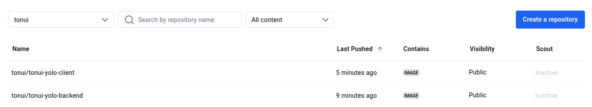

# Week 5 IP 2: Creating a Basic Microservice

## 1. Base Image Selection

The base image used to build the containers is `node:16-alpine3.16`. This image is based on Alpine Linux, a minimal and security-focused distribution, making it lightweight and efficient. It is specifically chosen for the following reasons:

- **Lightweight**: The Alpine Linux distribution is compact, reducing the overall image size.
- **Compatibility**: Node.js version 16 is used, which is stable and compatible with the dependencies and features required by the client and backend applications.
- **Security**: Alpine Linux has fewer security vulnerabilities due to its reduced attack surface.

### Base Images:

- **Client Base Image**: `node:16-alpine3.16`
- **Backend Base Image**: `node:16-alpine3.16`
- **MongoDB Base Image**: `mongo:6.0` (official MongoDB image)

---

## 2. Dockerfile Directives for Container Creation and Execution

### Client Dockerfile

The Client Dockerfile uses a multi-stage build process to reduce the final image size and improve efficiency.

#### Build Stage:

1. `WORKDIR /client`: Set the working directory inside the container.
2. `COPY package*.json ./`: Copies the `package.json` and `package-lock.json` files.
3. `RUN npm install --only=production`: Installs only production dependencies and cleans up unnecessary files.
4. `COPY . .`: Copies the entire application code.
5. `RUN npm run build`: Builds the production-ready app.

#### Production Stage:

1. `FROM nginx:1.23-alpine`: Use NGINX as the production server.
2. `COPY --from=build-stage /client/build /usr/share/nginx/html`: Copies the built application from the build stage.
3. `EXPOSE 80`: Exposes port 80 for the client application.
4. `CMD ["nginx", "-g", "daemon off;"]`: Defines the command to run NGINX.

### Backend Dockerfile

The Backend Dockerfile is similar but focuses on API creation.

#### Steps:

1. **Install Dependencies**:

   - `WORKDIR /usr/src/app`: Set the working directory.
   - `COPY package*.json ./`: Copy the necessary package files.
   - `RUN npm install`: Installs all dependencies.

2. **Create Runtime Environment**:
   - `COPY . .`: Copies the entire application code.
   - `EXPOSE 5000`: Exposes port 5000 for the backend API.
   - `CMD ["node", "server.js"]`: Starts the backend server when the container is run.

---

## 3. Docker Compose Networking

The `docker-compose.yaml` file configures the services with a custom bridge network (`app-net`) to ensure seamless communication between containers.

### Service Definitions:

1. **Client**:

   - `ports: "3000:80"`: Maps port 80 in the container (NGINX) to port 3000 on the host.
   - `depends_on: tonui-yolo-backend`: Ensures the backend is ready before starting the client.
   - `networks: app-net`: Connects to the custom bridge network.

2. **Backend**:

   - `ports: "5000:5000"`: Maps port 5000 on the host to port 5000 in the container for the backend API.
   - `depends_on: app-ip-mongo`: Ensures MongoDB is ready before starting the backend.
   - `networks: app-net`: Connects to the custom bridge network.

3. **MongoDB**:
   - `ports: "27017:27017"`: Maps the MongoDB default port (27017) to the host machine.
   - `volumes: app-mongo-data`: Persists data across container restarts or deletions.
   - `networks: app-net`: Connects MongoDB to the custom bridge network.

### Network Setup:

- **Bridge Network (`app-net`)**: All services are connected to this network, allowing them to communicate internally. The custom bridge network ensures that each service can access the others without exposing unnecessary ports externally.

---

## 4. Docker Compose Volume Definition and Usage

The `docker-compose.yaml` file defines a volume for MongoDB to persist data across container restarts or deletions. The MongoDB data is stored in a named volume `app-mongo-data`, ensuring that the data remains intact even when the container is stopped or removed.

```yaml
volumes:
  app-mongo-data:
    driver: local
```

This volume is mapped to the MongoDB data directory within the container, ensuring persistent storage for the database.

---

## 5. Git Workflow to Achieve the Task

### Steps:

1. **Fork the Repository**:

   - Forked the repository from the original source.

2. **Clone the Repo**:

   ```bash
   git clone git@github.com:Maubinyaachi/yolo-Microservice.git
   ```

3. **Create `.gitignore`**:

   - Created a `.gitignore` file to exclude unnecessary files such as `node_modules` and logs from version control.

4. **Add Dockerfiles for Client and Backend**:

   ```bash
   git add client/Dockerfile
   git add backend/Dockerfile
   git commit -m "Added Dockerfiles"
   ```

5. **Add `docker-compose.yaml`**:

   ```bash
   git add docker-compose.yaml
   git commit -m "Added docker-compose file"
   ```

6. **Push Changes to GitHub**:

   ```bash
   git push
   ```

7. **Build the Docker Images**:

   ```bash
   docker compose build
   ```

8. **Push the Built Images to Docker Hub**:

   ```bash
   docker compose push
   ```

9. **Deploy the Containers using Docker Compose**:

   ```bash
   docker compose up
   ```

10. **Commit the Explanation**:
    - Created and committed the `explanation.md` file.

---

## 6. Successful Running of the Applications and Debugging Measures

The applications (client, backend, and MongoDB) were successfully deployed using Docker Compose. If issues arose during deployment, the following debugging steps were applied:

1. **Check Logs for Errors**:

   ```bash
   docker logs <container_name>
   ```

2. **Use Docker Compose Logs**:

   ```bash
   docker-compose logs
   ```

3. **Check Network Configuration**:
   - Ensured that all services were connected to the same network (`app-net`), enabling proper internal communication.

---

## 7. Good Practices for Docker Image Tagging and Versioning

To follow Docker best practices, image tags were used consistently to ensure clarity and ease of management:

1. **Tagging**: The images were tagged with version numbers, such as:

   - `tonui/tonui-yolo-client:v1.0.0`
   - `tonui/tonui-yolo-backend:v1.0.0`
   - `tonui/tonui-mongo:v1.0.0`

2. **Latest Tag**: The `latest` tag was applied to the most recent stable versions of the images to ensure clarity during deployment and to track version history efficiently.

---

## 8. Screenshot of Deployed Image on DockerHub


